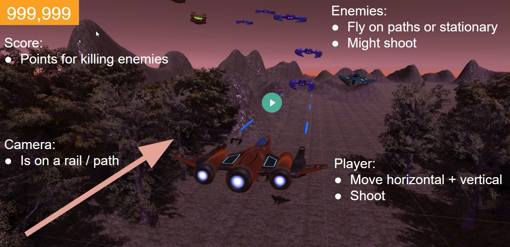

## [gamedev.tv]

### course: Complete Unity 3D Developer

#### project: Argon Assault 

`[Unity ver.: 2022.3.30f1]`

Rail shooter que emplea Timeline para la navegación del jugador sobre el mapa.

#### Game Screen

#### Game Design

- **Experiencia de juego:**
 
  Caos

- **Mecánica principal:**

  Esquivar y Disparar

- **Bucle principal:**

  Llegar lo más lejos posible sin morir para alcanzar la mayor puntuación.

  Empieza desde el principio al morir.

- **Flujo y Pantallas:**

#### Tema del Juego (Story & Visuals)

Debes salvar tu planeta, Argon, de la destrucción por una fuerza alienígena invasora.

#### Características principales

- **Raíl de Cámara**: Camino a través del nivel que debe seguir la cámara.

- **Movimiento del jugador**: movimiento vertical y horizontal

- **Disparo**: La nave del jugador dispara proyectiles que dañan a los oponentes.

- **Salud**: Los enemigos tienen salud que decrece al recibir impactos.

- **Caminos de los enemigos**: Los enemigos deben viajar en caminos establecidos durante el diseño.

- **Puntuación**: Puntos por la destrucción de enemigos.

- **Bucle principal**: Tras morir, se reinicia el nivel.

#### Otras características (opcionales)

- **Múltiples niveles**

- **Escudo para la nave**

- **Coleccionables**

- **Invulnerabilidad transitoria**

- **Mejoras del arma**

